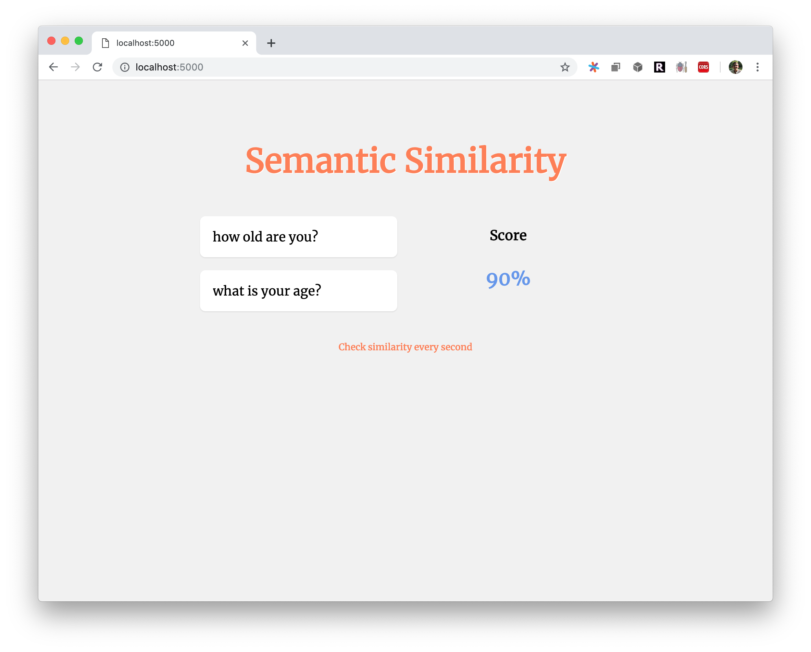

# semantic-similarity-demo

This is small application is a demo use of Google Universal Sentence Encoder.


## Getting code
```
git clone https://github.com/drbh/semantic-similarity-demo.git
cd semantic-similarity-demo
```

## Install Deps
You'll need Python3.7, Tensorflow, Tensorflow Hub, and Flask to run

## Note
This model assumes you've downloaded the Universal Sentence Encoding (3) model and placed in in a local folder. In this demo I have the model in a folder called `96e8f1d3d4d90ce86b2db128249eb8143a91db73`. So in order to run this yourself, please download the model from then TF Hub at https://tfhub.dev/google/universal-sentence-encoder-large/3 place it in a folder and point your script at that folder. Eveything else should workd.


## Starting server
```
python3 server.py 
```


# General example (Google)

In this image we can see that the two questions ask semantically (non literal) for the same information. Both questions illicit the same response (eg. I am 25 years old)



You can see here that the model, really understands that these two questions have the same semantic meaning, dispite the fact that they have no similar words. Most similarity metrics that exist look at the words and not the abstract meaning. 

Other ways to achieve a similar result would be to do topic modeling - then classify words to topics and try to find similar topics. This would require alot of preprocessing effort and a need to make a complex dictionaries in order to catch all the possible topics.


# Similar classe title example

Here we use semantic similarity to check the similarity of class names. We enter two topic names, that have very similar content (in terms of skills needed to understand).

integer programming and linear optimization are almost synonyms (of course if you understand the difference, you'll tell me how different these topics really are - but from a high and mid level these two are really similar). For our usecase this is a fantastic result! Completely different words, but connected at a core conceptual level.


# Non-similar class title example

Okay great, now we want to see out model show a bad score for classes with really different core concepts. Here we can see that the difference of an art based and math based class get a low score.


